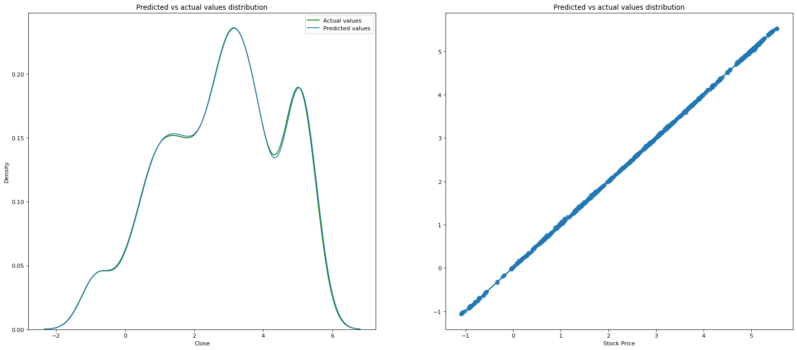
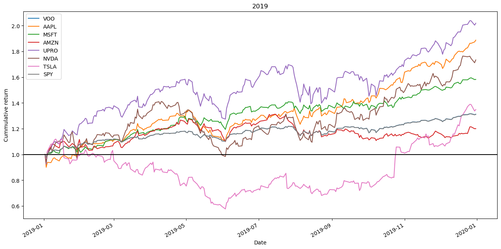
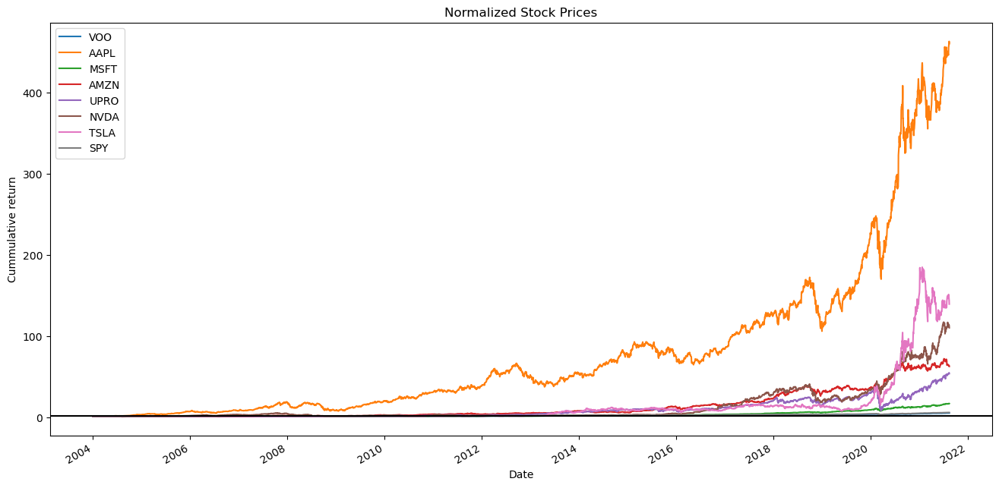
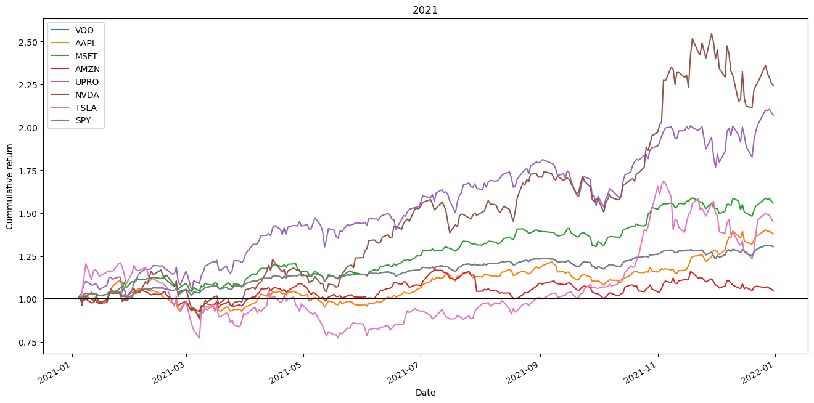

# Capstone Project Proposal: Investment Trading with Yahoo Finance Data

### 1. Domain Background

Investment trading is a critical domain in finance, involving decision-making based on economic
indicators, market sentiment, and statistical signals. Traditionally dominated by manual and
heuristic methods, modern trading increasingly relies on machine learning (ML) models for
predictive insights and automated decision-making. With the availability of historical financial
data from platforms such as Yahoo Finance, there is a unique opportunity to apply ML
algorithms to forecast stock price movements and improve trading strategies.

### 2. Problem Statement

The financial market is inherently volatile and non-linear, making it difficult to predict short-term
price movements. The core problem to be addressed in this project is: Can we predict the
next-day direction (up or down) of a stock's closing price using technical indicators derived from
historical data? This is a binary classification task where the performance of the model can
significantly impact trading outcomes and profitability.

### 3. Solution Statement

This project proposes the development of a machine learning classification model to predict
next-day stock price direction. The solution will leverage engineered features from historical
OHLCV (High, Low, Close, Volume) data, including technical indicators such as MACD,
RSI, SMA, and Bollinger Bands. Models such as Random Forest, XGBoost, and LSTM will be
explored to capture both non-linear relationships and temporal dependencies. The final solution
will be evaluated not only on classification metrics but also on its effectiveness in simulated
trading (e.g., ROI, Sharpe Ratio).

## Installations

The following libraries are needed to successfully run this project. First of all you will need to install `yfinance` using `pip install yfinance`.
I used python 3 for this project and other packages installed are:

1. sklearn
2. seaborn
3. matplotlib
4. pandas
5. numpy
6. tensorflow

### Overview

This project develops and evaluates three machine learning models—Linear Regression, Random Forest, and an LSTM neural network—to forecast daily stock price movements using historical market data. The goal is to provide investors and traders with actionable predictive insights into risk and return based on past price behaviors.

### Data Exploration

**Why Data Exploration Is Important**

- Humans process visual data far more effectively than raw tables; thousands of rows and columns are hard to interpret without visuals.
- Visual cues—shapes, colors, lines, and points—help data analysts quickly spot trends, anomalies, and relationships that might otherwise go undetected.

In this notebook we used:

- **Line plots** (e.g., normalized cumulative return) to compare stock trajectories.
- **KDE plots** to overlay the distributions of actual vs. predicted values.
- **Regression (“regplot”) visuals** to inspect model fit and residual patterns.



> **Example**: A cumulative return chart normalized to \$1 on day 1 highlights volatility spikes during major market events, guiding feature selection for the models.



### Preprocessing Steps

1. **Data Normalization**
   - Scaled each stock’s price series so that Day 1 = \$1, enabling direct comparison across tickers.



2. **Missing‑Value Imputation**

   - Filled forward with `df.fillna(method='ffill')` to maintain continuous time series.

```python
# Handling missing values
fin_data.fillna(method='ffill', inplace=True)
fin_data.fillna(method='bfill', inplace=True)
```

3. **Feature Engineering**
   - Computed **cumulative returns**.




4. **Train–Test Split**
   - Chronologically split data: first 80% of dates for training, last 20% for testing to mimic real‑world forecasting.

```python
#split the data into training and test sets
X_train, X_test, y_train, y_test = train_test_split(X, y, test_size=0.20, random_state=42)
```

## Algorithms and Techniques

### 1. LSTM Neural Network

**Why?** Designed for sequential data, can learn temporal dependencies in price series.

#### Architecture & Hyperparameters

```python
from tensorflow.keras.models import Sequential
from tensorflow.keras.layers import Input, LSTM, Dense
from sklearn.metrics import mean_absolute_error

model_lstm = Sequential([
Input(shape=(X_train.shape[1], 1)),
LSTM(128, return_sequences=True),
LSTM(64, return_sequences=False),
Dense(25, activation='relu'),
Dense(1)
])
model_lstm.compile(optimizer='adam', loss='mean_squared_error')
model_lstm.fit(X_train_reshaped, y_train, batch_size=1, epochs=5, verbose=1)

# Evaluate
preds_lstm = model_lstm.predict(X_test_reshaped)
mae_lstm = mean_absolute_error(y_test, preds_lstm)
```

**Refined Hyperparameters**

# Train the model - part 4 (increasing no. of epochs and batch_size)

xtrain = np.array(xtrain)
xtrain_reshaped = xtrain.reshape((xtrain.shape[0], xtrain.shape[1], 1))

model2.fit(xtrain_reshaped, ytrain, batch_size =100, epochs=10, verbose=0)

### 2. Linear Regression

**Why?** A simple, interpretable baseline for continuous price prediction.

**Implementation**

model_lin2 = LinearRegression()
#fit the model
model_lin2.fit(X_train,y_train)

#prediction
predict = model_lin2.predict(X_test)

#calculation of the mean absolute error
mean_abs_error = mean_absolute_error(y_test, predict)
mean_abs_error

### 3. Random Forest Regressor

**Why?** Captures non‑linear relationships and feature interactions, robust to outliers.

**Implementation**

# creating an instance of a Random Forest Regressor

model_rf2 = RandomForestRegressor(n_estimators=100, random_state=47)

#fit the model with the training data
model_rf2.fit(X_train,y_train)

#prediction
predict2 = model_rf2.predict(X_test)
predict2 #view some predictions

#calculation of the mean absolute error
mean_abs_error2 = mean_absolute_error(y_test, predict2)
mean_abs_error2```

## Implementation Details

#### Data Loading

**Historical price data fetched via pandas_datareader from Yahoo Finance.**

# dowloading yahoo finance

import yfinance as yfin

tickers = ('VOO', 'AAPL', 'MSFT', 'AMZN', 'UPRO', 'NVDA', 'TSLA', 'SPY')

start = "2004-01-01"
end = '2024-12-31'

fin_data = yfin.download(tickers, start, end) # downloading yahoo finance data for a specific date

fin_data.to_csv('./data/fin_data.csv')```

**Preprocessing & Feature Engineering**

- Normalization, forward‑fill, cumulative returns, moving averages.

**Visualization**

- Plots generated with Matplotlib (cumulative returns) and Seaborn (KDE, regplot).

**Model Training & Evaluation**

- Trained three models as above.
- MAE (all models).

**Prediction Visuals**

- Overlaid KDE of actual vs. predicted.
- Regression plots of predictions vs. true values.
- Line Plots

## Justification

### Evaluation and Validation of models

From my investigation of three different models, I observed that RandomForestRegressor delivered a much lower mean absolute error **(0.00755, 0.0038)** than the LSTM **(0.0087, 1.530)** or LinearRegression **(0.646, 0.132)** for Apple and SPY respectively. I also observed that tuning the parameters for LSTM (e.g the number of epochs and batch_size) resulted in better prediction.

### Interesting facts about the project

When exploring the data, it was interesting to see how the stock prices of different companies changed due to the pandemic and how the technological companies stock prices bounced back more quickly than the other companies considered.
Here are some major highlights from the data exploration section:

From the above plots, let's take note of the following:

- 2019: Before the pandemic, we notice that most of the companies stocks were doing relatively well with Apple and UPRO taking the lead and Amazon and Tesla trailing behind.
- 2020: On the onset of the pandemic around Spring, we notice that there was a fall in stock prices for all the companies, but afterwards the technology companies like Amazon, Apple, NVDIA, Tesla and Microsoft started to grow again. But UPRO and VOO had a steady growth. Tesla stocks took off and had the greatest return!
- 2021: Overall there was an improvement in the stock prices of all the companies we considered.
- 2022: Rising inflation, increased interest rates, and the Russia-Ukraine war had a negative impact on the market. Tesla was hit the hardest.
- 2023: There was an overall improvement compared to last year. NVDIA and Tesla grew exponentially.

### Difficulties encountered

The Machine Learning for Trading project really helped me understand market. I learned so much. I spent some time watching courses from Khan Academy to understand the basic concepts of the Stock Market. I was able to learn to perform EDA with financial datasets. An additional practice to choosing the right model to predict the stock values.
In the modelling part (particularly the LSTM), one would have to spend some time tuning the parameters and training it to get the best results.

### Improvements

An improvement to my analysis could be the following:
Take some significant time to tune the model parameters as well as include more features that might be relevant for stock price prediction.
Try out more models and see if there might be one with a better performance than the **RandomForestRegressor**. I only tried three models for simplicity and time constraints.
Explore other companies stocks to see how well one can predict their stocks prices with different models.
